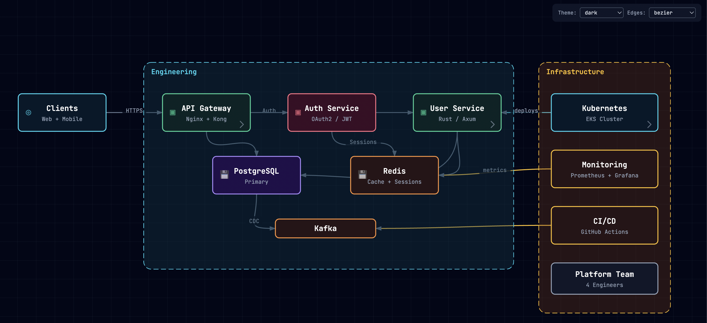

# system-canvas

Interactive, zoomable SVG diagrams from JSON Canvas documents.



## Packages

| Package | Description |
|---------|-------------|
| `system-canvas` | Pure TypeScript core. Types, themes, edge routing, viewport math. Zero dependencies. |
| `system-canvas-react` | React components. Pan/zoom viewport, node renderers, breadcrumb navigation. |

## Install

```bash
npm install system-canvas system-canvas-react
```

## Quick start

```tsx
import { SystemCanvas } from 'system-canvas-react'

const canvas = {
  theme: {
    base: 'dark',
    categories: {
      service: {
        defaultWidth: 140, defaultHeight: 60,
        fill: 'rgba(6, 78, 59, 0.4)', stroke: '#34d399',
      },
    },
  },
  nodes: [
    { id: 'api', type: 'text', text: 'API Server\nExpress', x: 0, y: 0, category: 'service' },
    { id: 'db', type: 'text', text: 'PostgreSQL', x: 250, y: 0, width: 140, height: 60, color: '6' },
  ],
  edges: [
    { id: 'e1', fromNode: 'api', toNode: 'db', label: 'queries' },
  ],
}

function App() {
  return (
    <div style={{ width: '100vw', height: '100vh' }}>
      <SystemCanvas canvas={canvas} />
    </div>
  )
}
```

## Features

- **Pan and zoom** with mouse/trackpad (d3-zoom)
- **Nested canvases** -- nodes with a `ref` property are clickable; clicking navigates to a sub-canvas with breadcrumb trail back
- **5 built-in themes** -- dark, midnight, light, blueprint, warm
- **3 edge routing modes** -- bezier, straight, orthogonal
- **Categories** -- define reusable node styles (dimensions, colors, icons) in the theme
- **JSON Canvas compatible** -- extends the [JSON Canvas spec](https://jsoncanvas.org) with `ref`, `category`, and inline `theme`

## Themes

```tsx
import { SystemCanvas } from 'system-canvas-react'
import { themes } from 'system-canvas'

<SystemCanvas canvas={data} theme={themes.midnight} />
<SystemCanvas canvas={data} theme={themes.blueprint} />
```

Or set the base theme in the canvas data itself:

```json
{ "theme": { "base": "warm" }, "nodes": [...] }
```

## Navigation

Nodes with a `ref` property become navigable. Provide an `onResolveCanvas` callback to load sub-canvases:

```tsx
<SystemCanvas
  canvas={rootCanvas}
  onResolveCanvas={async (ref) => {
    const response = await fetch(`/api/canvas/${ref}`)
    return response.json()
  }}
/>
```

## Props

| Prop | Type | Description |
|------|------|-------------|
| `canvas` | `CanvasData` | Canvas document to render |
| `theme` | `CanvasTheme` | Theme override (optional, defaults to dark) |
| `edgeStyle` | `'bezier' \| 'straight' \| 'orthogonal'` | Edge routing mode (default: bezier) |
| `onResolveCanvas` | `(ref: string) => Promise<CanvasData>` | Resolve a ref to sub-canvas data |
| `onNodeClick` | `(node: CanvasNode) => void` | Node click handler |
| `onNodeDoubleClick` | `(node: CanvasNode) => void` | Node double-click handler |
| `onEdgeClick` | `(edge: CanvasEdge) => void` | Edge click handler |
| `onContextMenu` | `(event: ContextMenuEvent) => void` | Right-click handler |
| `onNavigate` | `(ref: string) => void` | Called when navigating to a sub-canvas |
| `onBreadcrumbClick` | `(index: number) => void` | Called when a breadcrumb is clicked |
| `rootLabel` | `string` | Root breadcrumb label (default: "Home") |
| `minZoom` | `number` | Minimum zoom level (default: 0.1) |
| `maxZoom` | `number` | Maximum zoom level (default: 4) |
| `defaultViewport` | `ViewportState` | Initial viewport position and zoom |
| `onViewportChange` | `(viewport: ViewportState) => void` | Called on pan/zoom |

## JSON Canvas extensions

This library extends the [JSON Canvas 1.0 spec](https://jsoncanvas.org) with three additive fields:

| Field | On | Purpose |
|-------|-----|---------|
| `ref` | any node | URI pointing to a sub-canvas for drill-down navigation |
| `category` | any node | Maps to a category definition in the theme for reusable styling |
| `theme` | top-level | Inline base theme name and category definitions |

Standard JSON Canvas documents render correctly. The extensions are ignored by other viewers.

## Development

```bash
npm install
npm run build    # build core + react
npm run dev      # start demo at localhost:5173
```

## License

MIT
